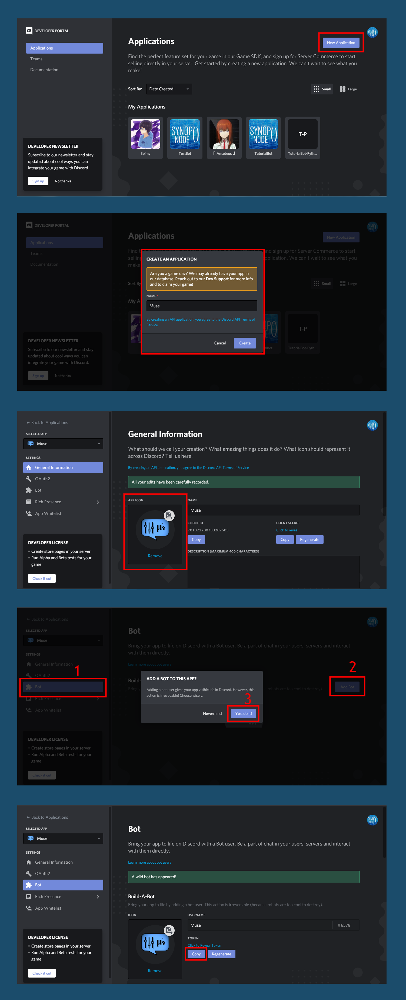

# Muse (μ's)

\
[](https://discord.gg/865tNC4)\
A discord.js bot template already containing music functions\
You can add to this bot by writing your own commands code and putting in the commands folder

## Requirements

You are required to have NodeJS installed.\
If you do not have NodeJS installed, download it at <https://nodejs.org/> and run the installer.

Once installed, open your command line and run `node -v` to check if has been properly installed.

## Development Installation

- Fork this repo
- Clone your fork to your local machine
- CD into the bots root directory
- Run `npm install`
- Copy your [discord token](#getting-a-discord-bot-token) into [config.json](config.json)
- Set a command prefix in [config.json](config.json)
- Run `npm start` or `node index.js`

## Getting a Discord Bot Token

- Head on over to [Discord's Developer Page](https://discordapp.com/developers/applications/)
- Sign in with your Discord account, if you are not already signed in
- Click the "New Application" button
- Give the application a name
- On the "General Information" Tab, give your application an avatar image
- Click the bot tab on the left hand side menu
- Then click "Add Bot" & confirm by clicking "Yes, Do it"
- Finally, copy the bot token

Note: Do NOT share your bot token with anyone!



## Command File Template

Make sure you follow the `help` object's syntax! It is very important for the `help` command to detect
the information of your command!

The way I did it in my code:

```js
module.exports.execute = async (client, message, args) => {
    // Commad code in here
}

module.exports.help = {
    name: "", // The name of the command
    aliases: [], // Add aliases inside the array
    category: "", // Specify which category this command belongs to
    usage: "", // Specify the arguments taken by the command
    description: "" // A short description about your command
}
```

Alternative:

```js
module.exports = {

    execute: async (client, message, args) => {
        // Commad code in here
    },

    help: {
        name: "", // The name of the command
        aliases: [], // Add aliases inside the array
        category: "", // Specify which category this command belongs to
        usage: "", // Specify the arguments taken by the command
        description: "" // A short description about your command
    }

}
```

## Author

[Spimy:](https://github.com/Spimy)

- Discord: Biribiri#6160
- YouTube: <https://www.youtube.com/channel/UCNfE0E97k3fouJg-2nulLKg>
- Twitter: <https://twitter.com/OfficialSpimy>
- Instagram: <http://instagram.com/OfficialSpimy>

## Support Server

[](https://discord.gg/865tNC4)
